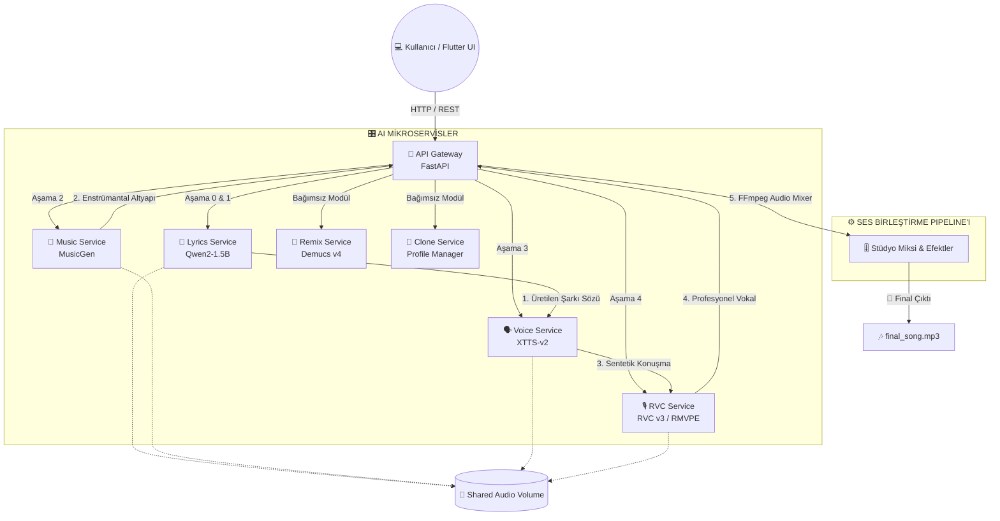
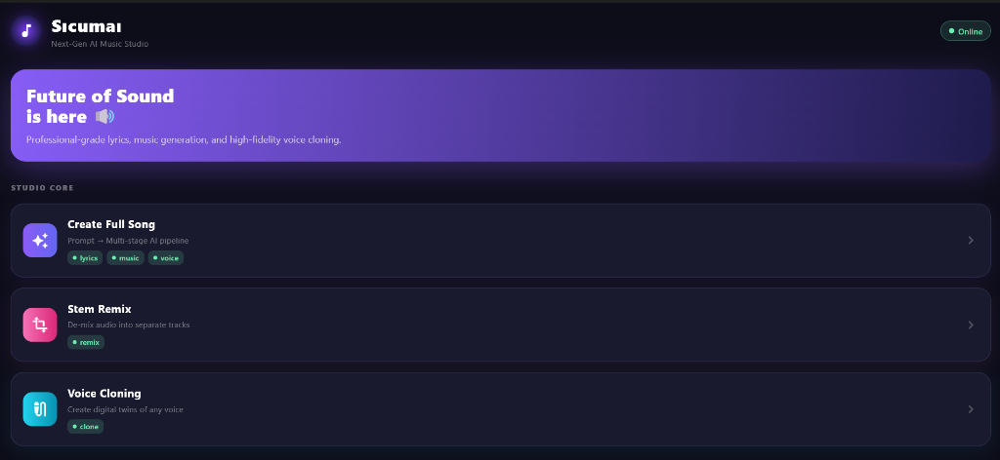
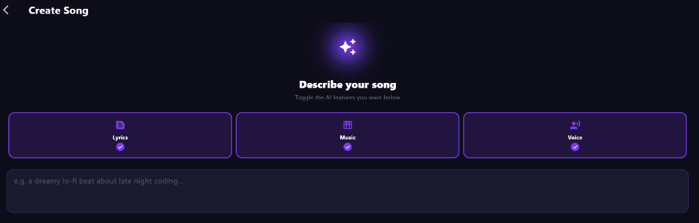
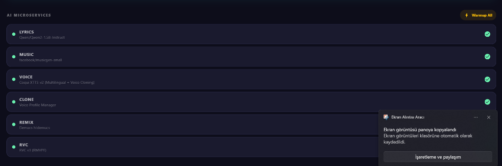
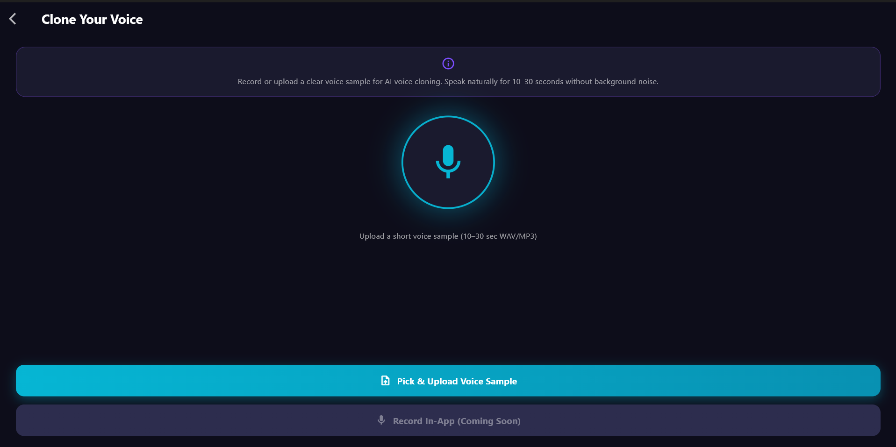
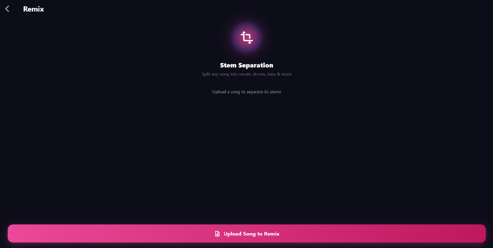

# 🔊 Sıcumaı AI Music Studio — Next-Gen AI Orchestration

**Sıcumaı**, modern derin öğrenme (Deep Learning) modellerini tek bir çatı altında toplayan, çok aşamalı (**multi-stage**) ve tamamen otonom bir müzik üretim ve ses mühendisliği stüdyosudur. Bu proje, metin tabanlı fikirleri şarkı sözlerine, bestelere, vokallere dönüştürür ve profesyonel stüdyo miksajı yaparak eksiksiz bir şarkı çıktısı sunar.

[](LICENSE)
[](https://www.python.org/)
[](https://fastapi.tiangolo.com/)
[](https://flutter.dev/)
[](https://www.docker.com/)

---

## 🏛️ Sistem Mimarisi ve İş Akışı (Architecture)

Sistem, **Microservices (Mikroservis) Mimarisi** ve **API Gateway** desenini takip eder. Her bir yapay zekâ modeli bağımsız bir Docker konteyneri içinde izole edilmiştir. Bu sayede modeller arası kütüphane (CUDA/PyTorch versiyonları) çakışmaları engellenirken, kaynak yönetimi en üst düzeye çıkarılmıştır.

### Uçtan Uca Akış Diyagramı (Mermaid)



---

## 📸 Uygulama Arayüzü (Application UI)

Projenin Flutter ile geliştirilmiş premium, modern karanlık tema (Dark Mode) destekli arayüzünden ekran görüntüleri:

<table align="center">
  <tr>
    <td align="center"><b>Ana Sayfa / Kontrol Paneli</b></td>
    <td align="center"><b>Şarkı Üretim Ekranı (Pipeline)</b></td>
  </tr>
  <tr>
    <td></td>
    <td></td>
  </tr>
  <tr>
    <td align="center"><b>Mikroservis & Model Durumları</b></td>
    <td align="center"><b>Ses Klonlama Arayüzü</b></td>
  </tr>
  <tr>
    <td></td>
    <td></td>
  </tr>
  <tr>
    <td align="center" colspan="2"><b>Stem Ayrıştırma & Remix Modülü</b></td>
  </tr>
  <tr>
    <td align="center" colspan="2"></td>
  </tr>
</table>

> 

---

## 🤖 Kullanılan Yapay Zekâ Modelleri (AI Stack)

Proje kapsamında **5 farklı son teknoloji derin öğrenme modeli** optimize edilerek sisteme entegre edilmiştir:

### 1. 📝 Qwen2-1.5B-Instruct (Söz Yazarı & Dil Zekası)
*   **Görev:** Şarkı sözü üretimi, prompt zenginleştirme ve tür algılama.
*   **Özellik:** Alibaba'nın geliştirdiği bu LLM modeli sistemimizde **Çift Modlu** çalışır. Standart modda kafiyeli dizeler üretirken, `[SYSTEM]` girdilerinde kullanıcının kısa fikirlerini devasa müzik üretim komutlarına (Prompt Enhancement) dönüştürür.

### 2. 🎶 Facebook MusicGen-Small (Beste Motoru)
*   **Görev:** Metin açıklamalarından enstrümantal müzik besteleme.
*   **Özellik:** Metin-ses difüzyon mimarisine sahiptir. CUDA üzerinde `float16` (yarım hassasiyet) seviyesinde çalıştırılarak bellek tasarrufu (VRAM optimization) sağlanmıştır.

### 3. 🗣️ Coqui XTTS-v2 (Çok Dilli Vokal Sentezi)
*   **Görev:** Metni sese dönüştürme ve ses klonlama.
*   **Özellik:** Türkçe dahil 17 dilde doğal insan sesi sentezler. 3-4 saniyelik bir konuşma örneği üzerinden (zero-shot learning) konuşmacının dijital ikizini çıkarabilir.

### 4. 🎙️ RVC v3 + RMVPE (Yüksek Kaliteli Vokal Kaplama)
*   **Görev:** TTS sesini şarkıcı vokaline dönüştürme.
*   **Özellik:** *Retrieval-based Voice Conversion* teknolojisi ile vokal tınısını hedef modele giydirir. `protect=0.5` ayarı sayesinde doğal nefes seslerini ve ton geçişlerini koruyarak tamamen insansı sonuçlar verir.

### 5. 🔀 Demucs v4 htdemucs (Ses Ayrıştırıcı)
*   **Görev:** Şarkıları izole kanallarına ayırma (Stem Separation).
*   **Özellik:** Facebook'un Hybrid Transformer tabanlı modelidir. Herhangi bir şarkıyı vokal (`vocals`) ve enstrümantal (`no_vocals`) olarak sıfır sızıntı ile birbirinden ayırır.

---

## 🔧 Gelişmiş Mühendislik Kararları & Optimizasyonlar

### 1. GPU Kaynak ve Bellek Yönetimi
Yapay zeka modelleri VRAM üzerinde ciddi yük oluşturur. Bunu yönetmek için şu teknikleri kullandık:
*   **Dynamic VRAM Release:** Her sentezleme bittiğinde Python tarafında `torch.cuda.empty_cache()` ve `gc.collect()` çağrılarak GPU belleği sisteme iade edilir.
*   **Parallel Model Warmup:** Gateway üzerinde tek tuşla çalışan `/warmup` endpoint'i ile konteynerler ayağa kalktığı an tüm ağırlık dosyaları GPU belleğine asenkron olarak önceden yüklenir, böylece ilk istek gecikmesi engellenir.

### 2. Stüdyo Kalitesinde Post-Processing (FFmpeg)
Sentezlenen ham vokaller ve müzikler ham şekilde birleştirilmez. Gateway üzerinde dinamik FFmpeg filtre zincirinden geçer:
*   `aecho=0.8:0.88:60:0.4` -> Vokale profesyonel stüdyo derinliği veren 60ms'lik eko.
*   `volume=1.5` ve `volume=0.8` -> Vokali öne çıkaran, müziği arka plana alan dengeli seviyelendirme.
*   `amix=inputs=2:duration=shortest` -> İki kanalı kusursuz senkronizasyonla birleştirir.

### 3. Veri Paylaşımı (Docker Volumes)
Modeller arası devasa ses dosyası transferlerinin ağ üzerinden geçmesi yerine, Docker tarafında tanımlanan `shared_audio` disk alanı kullanılmıştır. Böylece servisler birbirine fiziksel dosya kopyalamak yerine diskteki yerel yollar (path) üzerinden anlık olarak erişim sağlar.

---

## 📦 Kurulum ve Çalıştırma (Setup)

### Gereksinimler
*   Docker & Docker Compose
*   NVIDIA GPU (Min 8GB VRAM ve CUDA 12.x önerilir)
*   NVIDIA Container Toolkit (Docker'ın GPU'ya erişmesi için)

### Adım Adım Çalıştırma
1.  **Depoyu bilgisayarınıza indirin:**
    ```bash
    git clone https://github.com/yonzbro/AIMUSICSTUDIO.git
    cd AIMUSICSTUDIO
    ```
2.  **Konteynerleri Build Edin & Ayağa Kaldırın:**
    ```bash
    docker-compose up -d --build
    ```
3.  **Flutter Windows Uygulamasını Başlatın:**
    ```bash
    cd mobile-app
    flutter run -d windows
    ```

---
*Bu proje, Yapay Zeka Destekli Yazılım Geliştirme dersi kapsamında **Sıcumaı Projesi** olarak hazırlanmış ve tüm süreç yapay zeka destekli kodlama metodolojileriyle geliştirilmiştir.*
