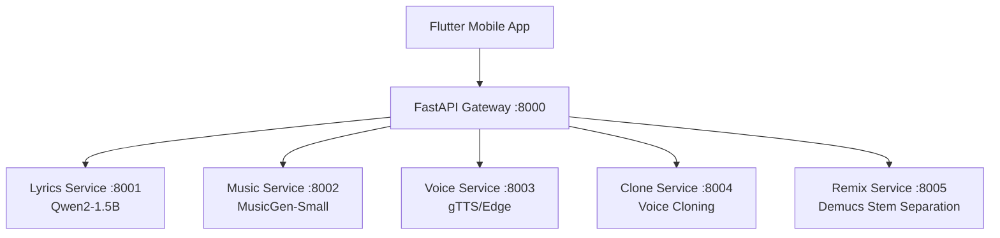

# 🎵 Antigravity AI Music Studio

[Türkçe](#türkçe) | [English](#english)

---

<div id="english">

## 🚀 Overview

**Antigravity AI Music Studio** is a state-of-the-art, AI-powered music generation ecosystem. It leverages a microservices architecture to handle lyrics generation, music synthesis, voice cloning, and audio remixing, all orchestrated through a high-performance FastAPI gateway and accessible via a sleek Flutter mobile application.

### ✨ Latest Enhancements (v1.1)
- **Studio Mastering**: Vocals now include professional `aecho` and `reverb` filters for a high-fidelity studio feel.
- **Infinite Looping**: Background beats now loop seamlessly to match the duration of your lyrics.
- **Universal MP3 Output**: All generated songs are automatically converted to high-quality MP3 for perfect compatibility with mobile players.
- **VRAM Memory Guard**: Optimized memory management for stable performance on mid-range GPUs (e.g., RTX 4060).

### 🏗️ Architecture



### 🛠️ Tech Stack
- **Backend:** Python, FastAPI, Docker, Docker Compose
- **Mobile:** Flutter (Dart)
- **AI Models:** 
  - `Qwen2-1.5B-Instruct` (Lyrics)
  - `facebook/musicgen-small` (Music)
  - `Demucs` (Remix/Stems)
- **GPU Acceleration:** CUDA supported via NVIDIA Container Toolkit.

### 🏁 Getting Started

1. **Prerequisites:**
   - Docker Desktop (v4+) & NVIDIA Container Toolkit
   - Flutter SDK (v3.0+)
   - Android Emulator/Device (API 28+ recommended)

2. **Run Backend:**
   ```powershell
   docker-compose up --build -d
   ```

3. **Run Mobile App:**
   ```powershell
   cd mobile-app
   flutter run
   ```

> [!IMPORTANT]
> **Android Configuration:** Ensure `android:usesCleartextTraffic="true"` is enabled in `AndroidManifest.xml` to allow audio streaming over HTTP.

</div>

---

<div id="türkçe">

## 🚀 Genel Bakış

**Antigravity AI Music Studio**, yapay zeka destekli son teknoloji bir müzik üretim ekosistemidir. Şarkı sözü yazımı, müzik sentezi, ses klonlama ve ses ayrıştırma görevlerini mikro servis mimarisiyle yönetir. Tüm süreç yüksek performanslı bir FastAPI gateway üzerinden yönetilir ve modern bir Flutter mobil uygulaması ile sunulur.

### ✨ Yeni Geliştirmeler (v1.1)
- **Stüdyo Mastering**: Vokaller artık yüksek kaliteli bir stüdyo hissi için profesyonel `aecho` ve `reverb` filtreleri içerir.
- **Sonsuz Döngü**: Arka plan beatleri, sözlerinizin süresiyle eşleşecek şekilde kusursuzca döngüye (loop) sokulur.
- **Evrensel MP3 Çıkışı**: Üretilen tüm şarkılar, mobil oynatıcılarla tam uyum için otomatik olarak yüksek kaliteli MP3 formatına dönüştürülür.
- **VRAM Hafıza Koruması**: RTX 4060 gibi orta segment GPU'larda kararlı performans için optimize edilmiş bellek yönetimi.

### 🏗️ Mimari Yapı

Sistem, her biri belirli bir AI görevinden sorumlu olan bağımsız Docker konteynırlarından oluşur. Bu yapı, ölçeklenebilirlik ve GPU kaynaklarının verimli kullanılmasını sağlar.

### 🛠️ Teknoloji Yığını
- **Backend:** Python, FastAPI, Docker, Docker Compose
- **Mobil:** Flutter (Dart)
- **Yapay Zeka Modelleri:** 
  - `Qwen2-1.5B-Instruct` (Söz Yazımı)
  - `facebook/musicgen-small` (Müzik Üretimi)
  - `Demucs` (Stem Ayrıştırma)

### 🏁 Başlangıç

1. **Gereksinimler:**
   - Docker Desktop & NVIDIA Container Toolkit
   - Flutter SDK (v3.0+)
   - Android Emülatör/Cihaz (API 28+ önerilir)

2. **Backend'i Başlat:**
   ```powershell
   docker-compose up --build -d
   ```

3. **Mobil Uygulamayı Çalıştır:**
   ```powershell
   cd mobile-app
   flutter run
   ```

> [!IMPORTANT]
> **Android Yapılandırması:** Ses akışının HTTP üzerinden sorunsuz çalışması için `AndroidManifest.xml` dosyasında `android:usesCleartextTraffic="true"` ayarının yapıldığından emin olun.

</div>

---

## 📋 Service Ports / Servis Portları

| Service / Servis | Port | Documentation / Dokümantasyon |
| :--- | :---: | :--- |
| **Gateway** | `8000` | [http://localhost:8000/docs](http://localhost:8000/docs) |
| **Lyrics Service** | `8001` | [http://localhost:8001/docs](http://localhost:8001/docs) |
| **Music Service** | `8002` | [http://localhost:8002/docs](http://localhost:8002/docs) |
| **Voice Service** | `8003` | [http://localhost:8003/docs](http://localhost:8003/docs) |
| **Clone Service** | `8004` | [http://localhost:8004/docs](http://localhost:8004/docs) |
| **Remix Service** | `8005` | [http://localhost:8005/docs](http://localhost:8005/docs) |

---
