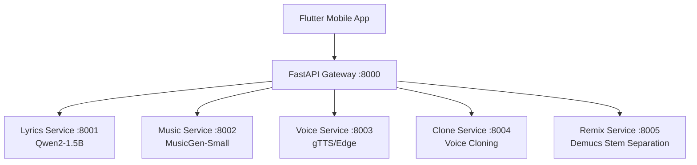

# 🎵 Antigravity AI Music Studio

[Türkçe](#türkçe) | [English](#english)

---

<div id="english">

## 🚀 Overview

**Antigravity AI Music Studio** is a state-of-the-art, AI-powered music generation ecosystem. It leverages a microservices architecture to handle complex AI tasks like lyrics generation, music synthesis, voice cloning, and audio remixing, all orchestrated through a high-performance FastAPI gateway and accessible via a sleek Flutter mobile application.

### 🏗️ Architecture



### 🛠️ Tech Stack
- **Backend:** Python, FastAPI, Docker, Docker Compose
- **Mobile:** Flutter (Dart)
- **AI Models:** 
  - `Qwen2-1.5B-Instruct` (Lyrics)
  - `facebook/musicgen-small` (Music)
  - `Demucs` (Remix/Stems)
- **GPU Acceleration:** CUDA supported via NVIDIA Container Toolkit.

### 🏁 Getting Started

1. **Prerequisites:**
   - Docker Desktop (v4+)
   - Flutter SDK (v3.0+)
   - NVIDIA GPU (Optional, for acceleration)

2. **Run Backend:**
   ```powershell
   docker-compose up --build -d
   ```

3. **Run Mobile App:**
   ```powershell
   cd mobile-app
   flutter pub get
   flutter run
   ```

</div>

---

<div id="türkçe">

## 🚀 Genel Bakış

**Antigravity AI Music Studio**, yapay zeka destekli son teknoloji bir müzik üretim ekosistemidir. Şarkı sözü yazımı, müzik sentezi, ses klonlama ve ses ayrıştırma gibi karmaşık görevleri mikro servis mimarisiyle yönetir. Tüm süreç yüksek performanslı bir FastAPI gateway üzerinden orkestre edilir ve modern bir Flutter mobil uygulaması ile kullanıcıya sunulur.

### 🏗️ Mimari Yapı

Mistem, her biri belirli bir AI görevinden sorumlu olan bağımsız Docker konteynırlarından oluşur. Bu yapı, ölçeklenebilirlik ve GPU kaynaklarının verimli kullanılmasını sağlar.

### 🛠️ Teknoloji Yığını
- **Backend:** Python, FastAPI, Docker, Docker Compose
- **Mobil:** Flutter (Dart)
- **Yapay Zeka Modelleri:** 
  - `Qwen2-1.5B-Instruct` (Söz Yazımı)
  - `facebook/musicgen-small` (Müzik Üretimi)
  - `Demucs` (Stem Ayrıştırma)
- **GPU Hızlandırma:** NVIDIA Container Toolkit ile CUDA desteği.

### 🏁 Başlangıç

1. **Gereksinimler:**
   - Docker Desktop (v4+)
   - Flutter SDK (v3.0+)
   - NVIDIA GPU (Hızlandırma için opsiyonel)

2. **Backend'i Başlat:**
   ```powershell
   docker-compose up --build -d
   ```

3. **Mobil Uygulamayı Çalıştır:**
   ```powershell
   cd mobile-app
   flutter pub get
   flutter run
   ```

</div>

---

## 📋 Service Ports / Servis Portları

| Service / Servis | Port | Documentation / Dokümantasyon |
| :--- | :---: | :--- |
| **Gateway** | `8000` | [http://localhost:8000/docs](http://localhost:8000/docs) |
| **Lyrics Service** | `8001` | [http://localhost:8001/docs](http://localhost:8001/docs) |
| **Music Service** | `8002` | [http://localhost:8002/docs](http://localhost:8002/docs) |
| **Voice Service** | `8003` | [http://localhost:8003/docs](http://localhost:8003/docs) |
| **Clone Service** | `8004` | [http://localhost:8004/docs](http://localhost:8004/docs) |
| **Remix Service** | `8005` | [http://localhost:8005/docs](http://localhost:8005/docs) |

---
