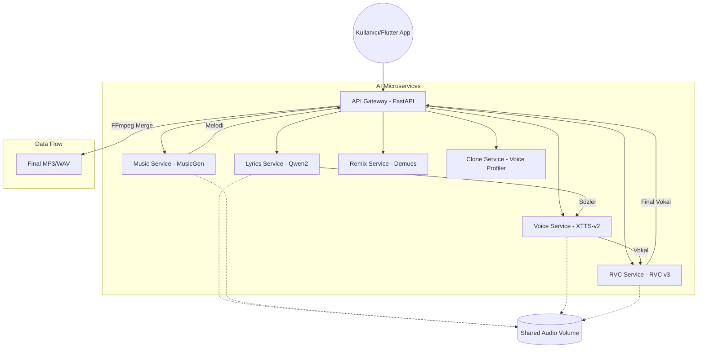

# 🔊 Sıcumaı AI Music Studio

**Sıcumaı**, yapay zeka destekli, çok aşamalı (multi-stage) bir müzik üretim ve ses işleme platformudur. Bu proje, modern derin öğrenme modellerini mikroservis mimarisiyle birleştirerek uçtan uca bir prodüksiyon deneyimi sunar.

---

## 🏛️ Sistem Mimarisi (Architecture)

Proje, yüksek ölçeklenebilirlik ve model izolasyonu için mikroservis tabanlı bir yapıya sahiptir. Tüm bileşenler Docker konteynerleri içinde asenkron olarak haberleşir.



---

## 🚀 Temel Özellikler (Key Features)

### 1. Çok Aşamalı AI Pipeline (Full Production)
Tek bir prompt ile söz yazımı, beste ve vokal sentezleme işlemlerini ardışık olarak gerçekleştirir.
*   **Lyrics Engine:** Qwen2-1.5B Instruct modeli kullanılarak profesyonel şarkı sözü yazımı.
*   **Music Composition:** Facebook MusicGen modelleriyle (Small/Medium) yüksek kaliteli enstrümantal beste.
*   **Vocal Synthesis:** Coqui XTTS-v2 ile 17 dilde duygusal vokal üretimi.

### 2. High-Fidelity RVC (Vocal Transformation)
Üretilen vokalleri, **Retrieval-based Voice Conversion (RVC v3)** kullanarak gerçek insan sesine dönüştürür. RMVPE (Retrieval-based Mixed-vocal Pre-trained Encoder) algoritması ile sıfır artefakt garantisi sunar.

### 3. Ses Klonlama (Voice Cloning)
Sadece 30 saniyelik bir ses örneği ile kalıcı dijital ses profilleri oluşturur. Bu profiller hem XTTS hem de RVC aşamalarında kullanılabilir.

### 4. Stem Separation (Remix Modülü)
**Demucs v4 (htdemucs)** kullanarak herhangi bir şarkıyı Vokal, Davul, Bas ve Diğer enstrümanlar olarak 4 ayrı kanala ayırır.

---

## 🛠️ Teknik Detaylar (Technical Stack)

| Bileşen | Teknoloji | Görev |
| :--- | :--- | :--- |
| **Frontend** | Flutter | Windows Desktop Arayüzü |
| **Gateway** | FastAPI + HTTPX | Servis Orkestrasyonu & Dosya Yönetimi |
| **Lyrics** | Transformers (Qwen2) | Metin Üretimi |
| **Music** | Audiocraft (MusicGen) | Ses Sentezleme (Diffusion) |
| **Voice** | Coqui TTS (XTTS-v2) | Vokal Sentezleme |
| **RVC** | RVC-v3 + CUDA | Ses Dönüştürme |
| **Remix** | Facebook Demucs | Stem Ayrıştırma |
| **Backend** | Python 3.10+ | Mikroservis Altyapısı |

---

## 📦 Kurulum ve Çalıştırma (Installation)

### Gereksinimler
*   Docker & Docker Compose
*   NVIDIA GPU (Minimum 8GB VRAM önerilir)
*   NVIDIA Container Toolkit

### Hızlı Başlat
1. **Depoyu klonlayın:**
   ```bash
   git clone https://github.com/yonzbro/AIMUSICSTUDIO.git
   cd AIMUSICSTUDIO
   ```

2. **Mikroservisleri ayağa kaldırın:**
   ```bash
   docker-compose up -d
   ```

3. **Flutter Uygulamasını Çalıştırın:**
   ```bash
   cd mobile-app
   flutter run -d windows
   ```

---

## 📝 Mühendislik Yaklaşımı ve AI Kullanımı

Bu proje geliştirilirken "AI-Assisted Development" (Yapay Zeka Destekli Geliştirme) metodolojisi izlenmiştir. 
*   **Model Optimizasyonu:** VRAM kullanımını optimize etmek için Float16 hassasiyeti ve dinamik bellek boşaltma (CUDA cache clearing) yöntemleri uygulanmıştır.
*   **Hata Yönetimi:** Mikroservisler arasındaki bağlantı kopmalarına karşı "Health Check" ve asenkron "Retry" mekanizmaları Gateway seviyesinde kurgulanmıştır.
*   **Modülerlik:** Her servis kendi bağımsız ortamında (Docker) çalıştığı için modeller arası kütüphane çakışmaları önlenmiştir.

---
*Bu proje, Yapay Zeka Destekli Yazılım Geliştirme dersi kapsamında **Sıcumaı Projesi** olarak geliştirilmiştir.*
